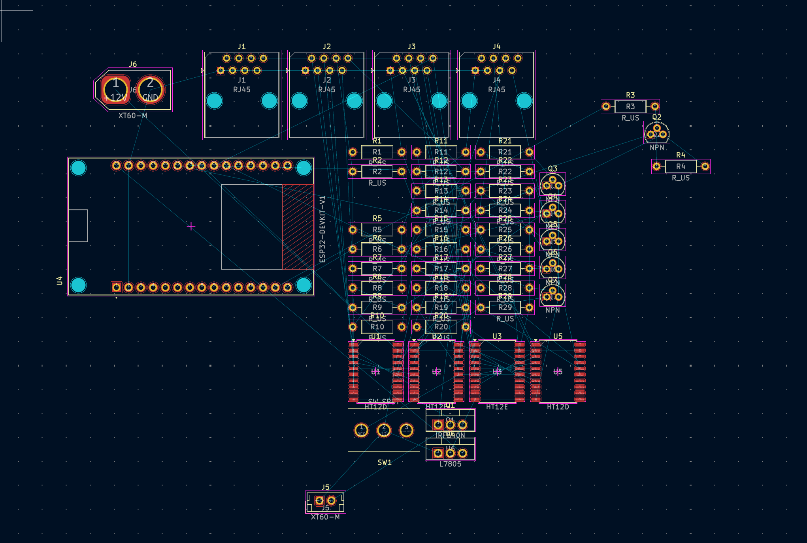
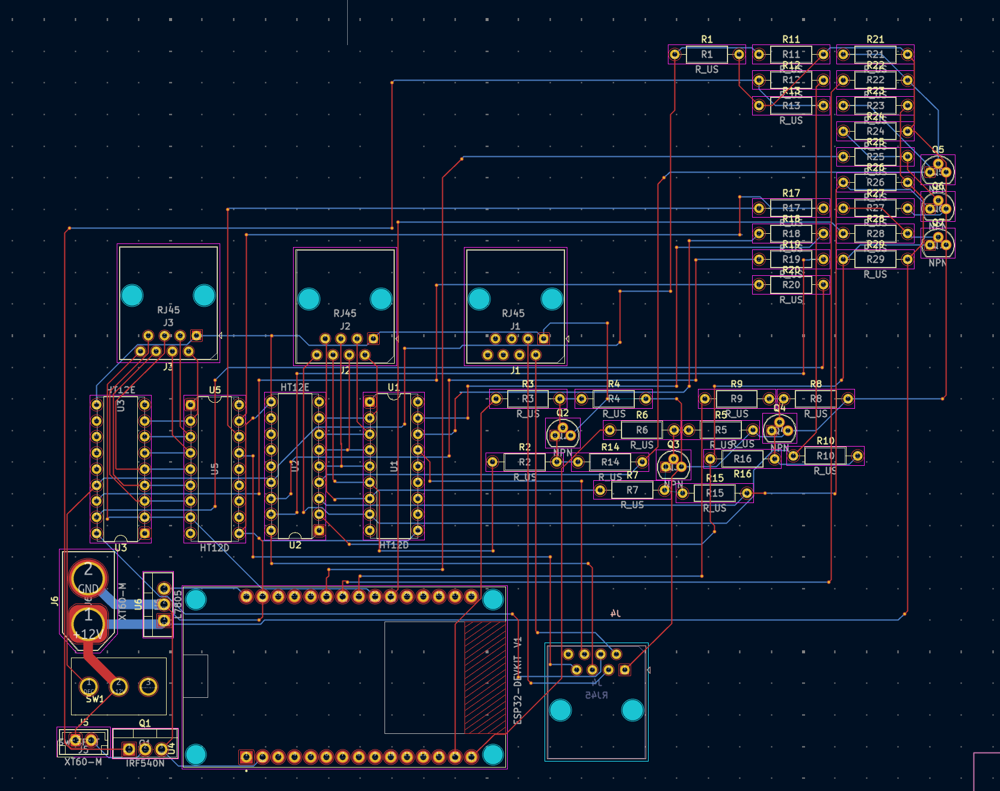

<!--
  ===================    !!READ THIS NOTICE!!   ====================
  DO NOT edit this file manually. Your changes WILL BE OVERWRITTEN!
  This journal is auto generated and updated by Hack Club Blueprint.
  To edit this file, please edit your journal entries on Blueprint.
  ==================================================================
-->

## 11/8/2025 - Configured layout for PCB  

Today, I finished placing all major components on the custom PCB for our rocket ground control system. This includes the ESP32, RJ45 ports for signal transmission, HT12E/HT12D encoder-decoder chips, NPN transistors for valve/igniter control, and the L7805 voltage regulator. I also added XT60 connectors for power input and set up resistor arrays for signal conditioning. The board layout is organized, but routing and zone fills still need to be done. 

  

## 11/10/2025 - Signal + Power Routing  

Today, I completed all the signal and power routing on the PCB. All connections between the ESP32, RJ45 ports, HT12E/HT12D chips, transistor drivers, and supporting components are now fully traced. I also finalized placement and routing for the resistor networks and MOSFET power stage. The layout is compact and clean, with minimal via usage and clear signal paths. Next, I’ll focus on ground pours, silkscreen adjustments, and a final DRC pass before generating Gerber files.

  

